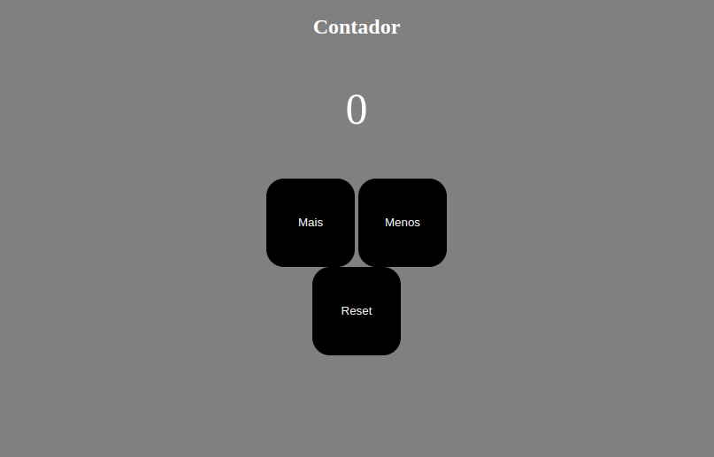

# Contador
<h1>
  
  </h1>
  <h3 align="center">
  <a href="https://thierrydrmv.github.io/contador/" target="_blank">Acessar o Contador</a>
</h3>
<ul> Crie um contador na WEB usando HTML, CSS e JS. com as funcionalidades abaixo: 
<li>Botão de adicionar no contador</li>
<li>Botão de diminuir no contador (Mostrando mensagem de erro caso fique negativo)</li>
<li>Resetar contador;</li>
